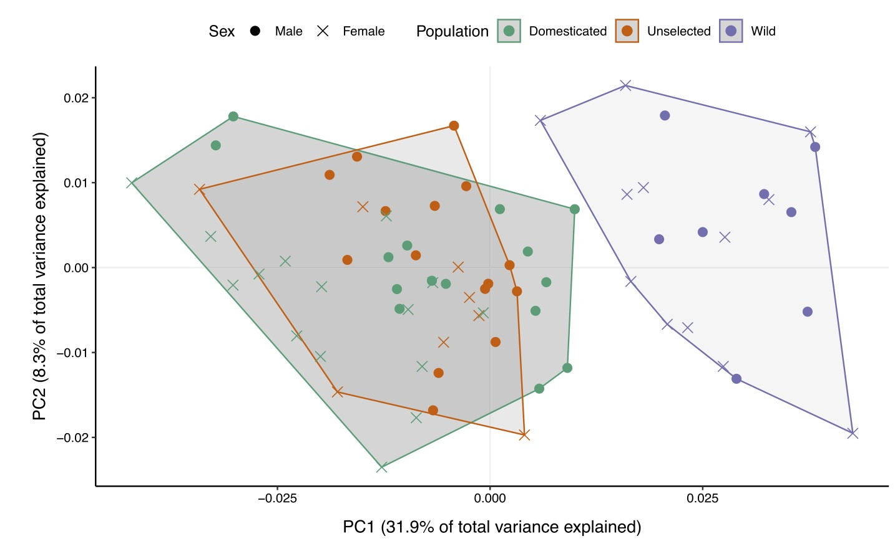
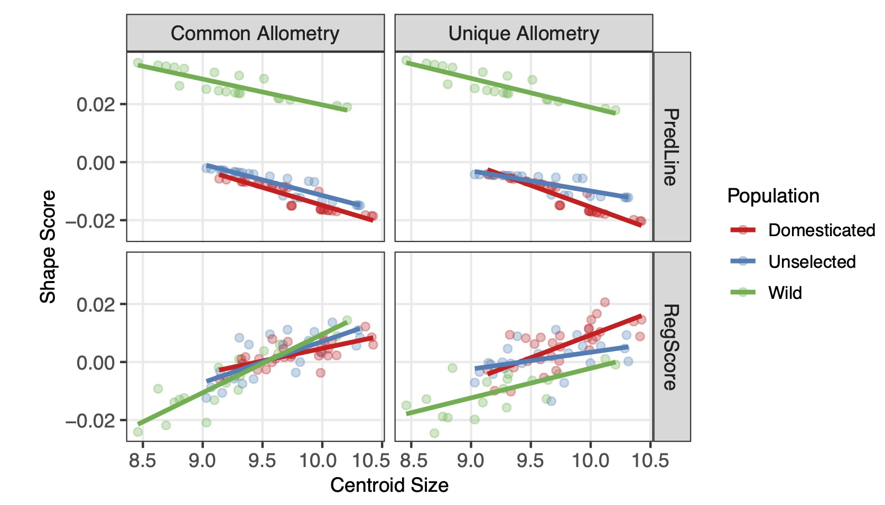
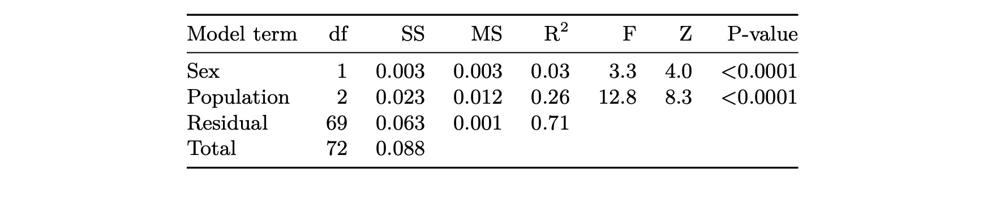
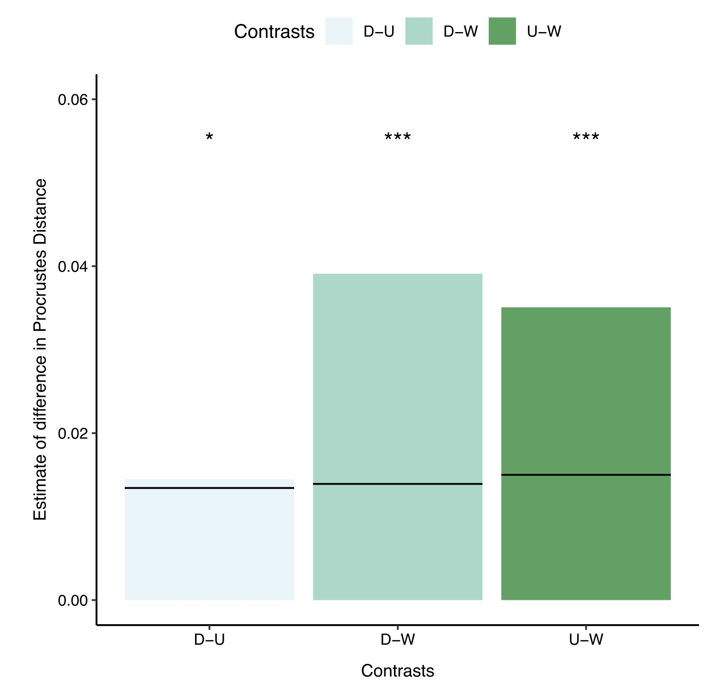
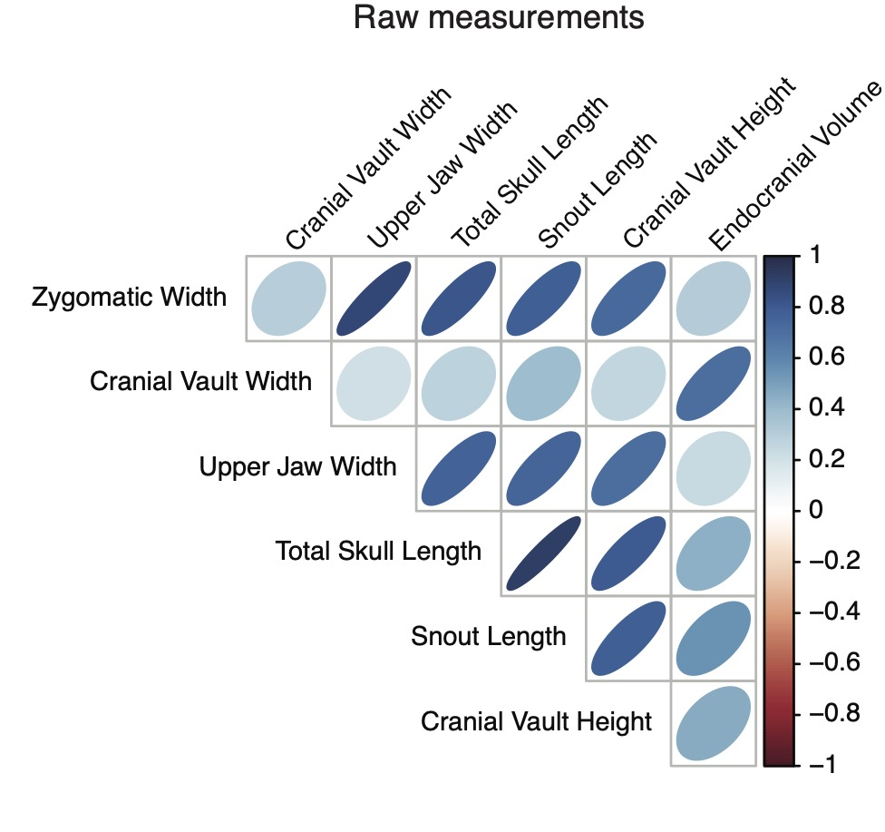
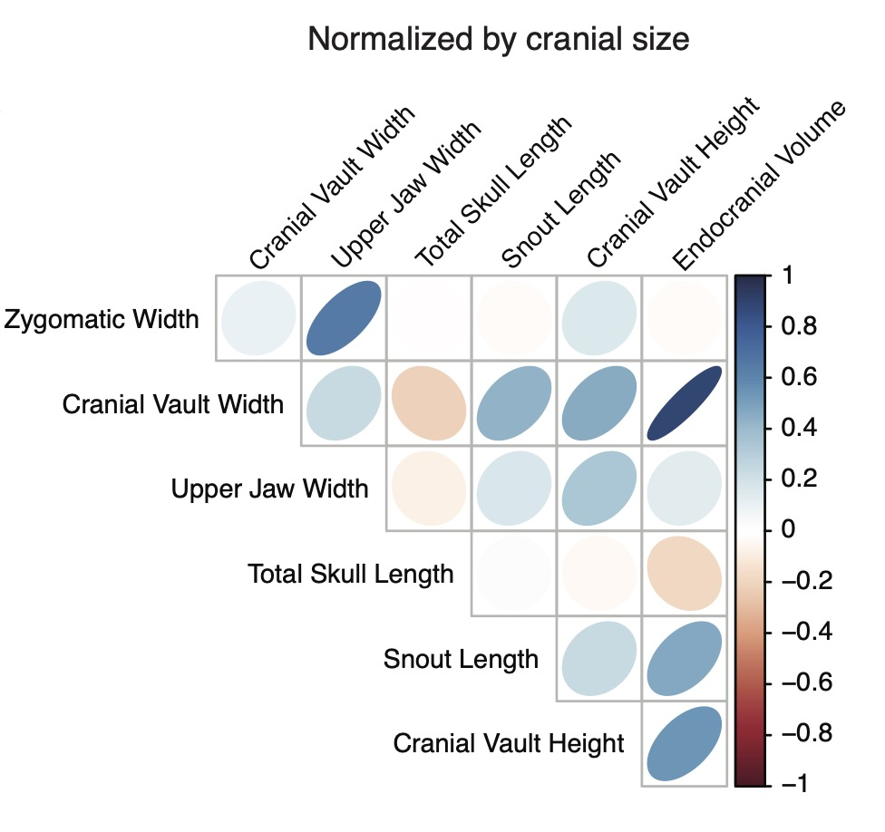
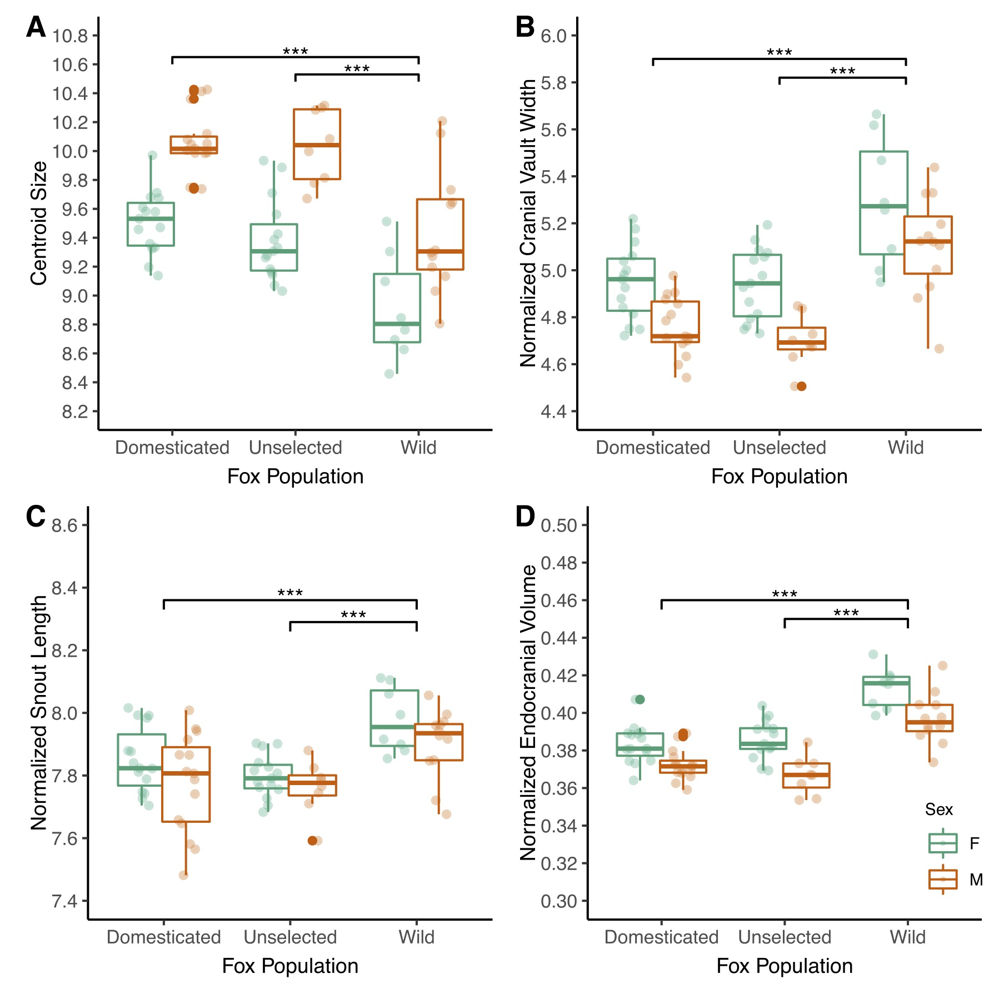

## Introduction

For this reproducibility project, I will be attempting to replicate the analyses of the following paper:

Kistner, T. M., Zink, K. D., Worthington, S., & Lieberman, D. E. (2021). Geometric morphometric investigation of craniofacial morphological change in domesticated silver foxes. Scientific reports, 11(1), 1-10.

There is a long-term, artificial selection study in Russia where researchers have tried to domesticate silver foxes. After only 8-10 generations, they found behavioral differences, and after a few more generations, morphological changes, including differences in craniofacial structure. From this and one other study, researchers have proposed a link between craniofacial changes and domestication. However, Kistner et al. (2021) noted potential issues with this hypothesis including the assumption that the unselected foxes from the original experiment had "wild-type" craniofacial shapes. The authors pointed out that these foxes may have experienced selective pressures from having been farmed for 60+ years. Thus, the goal of their study was to understand the effect of domestication on craniofacial skeletal morphology in silver foxes and specifically identify the magnitude of differences in craniofacial morphology between selected, unselected, and wild foxes. They predicted that the differences will be greater between wild and farmed foxes than between unselected and selected groups. They collected 3D landmark data, linear, and endocranial volume measurements on skulls from selected, unselected, and wild foxes. The authors used geometric morphometric analyses on the 3D data to create tangent space coordinates. They then used procrustes ANOVA on these coordinates to find average population differences. Finally, they used a generalized least squares model to analyze the linear and endocranial volume data. In addition to these analyses, the authors also assessed the repeatability of the skull measurements. Overall, they found that the two farmed fox populations were much more similar than either group was to wild foxes, suggesting that unselected fox cranial morphology is not an appropriate proxy for that of wild foxes. They further propose that craniofacial morphology is not a reliable predictor of docility in these foxes.

The data files have the following naming conventions:

3D landmark coordinates for each specimen : Fox_data_Morphologika.txt

linear measurements for all specimens : Fox_linear_volume_data.csv

Replication data measurements for 3D landmark coordinates: DF_morphologika.txt, DF476_morphologika.txt, 

DM_morphologika.txt, DM23_morphologika.txt, UF_morphologika.txt, UF1058_morphologika.txt

Replication data measurements for linear measurements: linear_cv_data.csv

For the 3D coordinate data, I replicated the geometric morphometrics analyses (translation,scaling,orthogonal projection), tested for allometry among populations, replicated the permutation-based Procrustes MANOVA, did pairwise comparisons of shape among populations, and plotted a PCA. For the linear data, I size-adjusted measurements and attempted to regress skull measurements against population id and sex. I did not replicate the sex dimorphism nor repeatability analyses.

## Data Analysis Replication

I will start with the 3D landmark data analysis. Here, I read in 3D landmark coordinate data and look at it. We use the geomorph package because it is a special file type (Morphologika). This was something that I had to google before I understood the file structure.

```{r}
knitr::opts_chunk$set(fig.path = "images/")
library(geomorph)
f <- "data/Fox_data_Morphologika.txt"
landmark <- read.morphologika(f)
str(landmark)
head(landmark$coords[,,1]) # some of the coordinate data

(n <- length(landmark$labels[,1])) # number of individuals we have 3D landmark data for
(p <- nrow(landmark$coords[,,1])) # number of measured coordinates
(k <- ncol(landmark$coords[,,1])) # number of dimensions to the coordinates
```

The landmark dataframe returns a list of 3. The first object in the list has the 3 dimensional coordinates for each sample. The second object has the labels for each sample (id, sex, and group). The final object contains the wireframe values.

Next we need to do a generalized Procrustes analysis. This involves translating landmarks to the origin, rescaling to centroid size, and rotating landmarks using a least squares criterion. This places homologous coordinates in close alignment (in same shape space, centered on the mean shape). From reading the geomorph package manual, this is all done using a single function gpagen.The authors mention in the methods that they use default parameters of the gpagen function.

```{r}
Pro_sup <- gpagen(landmark$coords)
names(Pro_sup)
str(Pro_sup)
```

The returned object (Pro_sup) is another list that contains a bunch of different objects. Some of these include an array of coordinates (coords), a vector of centroid sizes for each specimen (Csize), and a Procrustes distance matrix (procD).

Next, I need to project these coordinates onto a "linear tangent space." Looks like this is plotting coordinates on principal component axes. This allows the variance along different axes to be independent from one another (based on what I know of PCA). From some googling, it looks like I need to use gm.prcomp. This function defaults to using an OLS for centering, which I think the authors used (instead of GLS), but I am not 100% sure because they aren't specific in the manuscript. I also print out a summary and plot the amount of variance explained by each PC.

```{r}
library(ggplot2)

tang_space_coords <- gm.prcomp(Pro_sup$coords)
names(tang_space_coords)
summary(tang_space_coords)

# amount of variance explained by different principal components
pvar <- (tang_space_coords$sdev^2)/(sum(tang_space_coords$sdev^2)) 
names(pvar) <- seq(1:length(pvar))
barplot(pvar, xlab= "Principal Components", ylab = "% Variance")
```

The tang_space_coords object contains the component scores for each sample (x), decomposed VCV matrix values (d), VCV matrix variable loadings (rotation), list of shape coordinates at extreme ends of PC axes (shapes), among other things. I plot the principal components to see how much variance each explains.

```{r}
PCA_dataframe <- as.data.frame(tang_space_coords$x)
PCA_dataframe$ID <- rownames(tang_space_coords$x)
PCA_dataframe$Pop <- landmark$labels[,2]
PCA_dataframe$Sex <- landmark$labels[,1]

# getting hull values for plotting the hulls on top of the dots in the pc plot
grp.tame <- PCA_dataframe[PCA_dataframe$Pop == "Tame", ][chull(PCA_dataframe[PCA_dataframe$Pop == 
    "Tame", c("Comp1", "Comp2")]), ]  # hull values
grp.wild <- PCA_dataframe[PCA_dataframe$Pop == "Wild", ][chull(PCA_dataframe[PCA_dataframe$Pop == 
    "Wild", c("Comp1", "Comp2")]), ]  # hull values
grp.unselected <- PCA_dataframe[PCA_dataframe$Pop == "Unselected", ][chull(PCA_dataframe[PCA_dataframe$Pop == 
    "Unselected", c("Comp1", "Comp2")]), ]  # hull values

hull.data <- rbind(grp.tame, grp.wild, grp.unselected)

ggplot() + 
  geom_polygon(data=hull.data,aes(x=Comp1,y=Comp2,group=Pop),alpha=0.30) + # add the hulls
  geom_point(data=PCA_dataframe,aes(x=Comp1,y=Comp2,shape=Sex,colour=Pop)) + # add the point markers
  scale_colour_manual(values=c("Tame" = "green", "Wild" = "purple","Unselected" = "orange")) +
  xlab("PC1 (31.9%)") + ylab("PC2 (8.2%)") + coord_equal() +
  theme_bw() + 
  theme(panel.background = element_blank(), 
        panel.grid.major = element_blank(),  #remove major-grid labels
        panel.grid.minor = element_blank(),  #remove minor-grid labels
        plot.background = element_blank())
```
 
```{r echo=FALSE, out.width="75%"}

```

 Above I plot the first two PCs to compare with the figure in the paper and they match!

Now, I am ready to test hypotheses about shape differences among the three fox populations. The authors used a permutation-based Procrustes MANOVA to regress tangent space coordinates, which I generated above, on population id and sex. They use the geomorph package to do this. They first decided whether they needed to correct for scaling effects. To test this they looked for differences in allometry (i.e. characteristics changing with body size) among populations by using a permutation-based Procrustes MANOVA of tangent space coordinates on the interaction term of population id and centroid size. 

Looks like I need to use geomorph::procD.lm, which runs the linear model. From looking at another geomorph function, I get definitions for common and unique allometry models (which show up in Fig S2, so they must have run both).

common allometry: shape ~ size + groups

unique allometry: shape ~ size * groups

```{r}
# there are a bunch of other options, but I don't know what to choose since the authors do not specify so I will just be going with defaults.
comm_allom <- procD.lm(tang_space_coords$x ~ Pro_sup$Csize + landmark$labels[,2])
unique_allom <- procD.lm(tang_space_coords$x ~ Pro_sup$Csize*landmark$labels[,2])

comm_allom$aov.table
unique_allom$aov.table
```

When you look at the anova table you can see that the interaction of centroid size and population ID is not significant, which matches what they report in the paper. This means we don't have to account for allometry in the model we will run below.

Before I move on, I wanted to try and replicate figure S2, which shows the relationship between the fitted values from the model (shape scores) and centroid size (approximation of size). I have to use different criterion to display shape scores (PredLine - based on fitted values and RegScore - based on regression coefficients). These are plotted below and compared with the figure from the supplementals.
```{r}

par(mfrow=c(2,2))
plot(comm_allom$data$`Pro_sup$Csize`,comm_allom$fitted[,1],ylim=c(-0.03,0.03),xlab= "Centroid size",
     ylab="Shape scores",col=as.factor(landmark$labels[,2]),pch=16,main="Common Allometry - Pred Line")
plot(unique_allom$data$`Pro_sup$Csize`,unique_allom$fitted[,1],ylim=c(-0.03,0.03),xlab="Centroid size",
     ylab="Shape scores",col=as.factor(landmark$labels[,2]),pch=16, main = "Unique Allometry - Pred Line")
plotAllometry(comm_allom,comm_allom$data$`Pro_sup$Csize`,logsz=FALSE,method="RegScore",ylim=c(-0.03,0.03),
              xlab= "Centroid size",ylab="Shape scores",col=as.factor(landmark$labels[,2]),
              pch=16,main="Common Allometry - RegScore")
plotAllometry(unique_allom,unique_allom$data$`Pro_sup$Csize`,logsz=FALSE,method="RegScore",ylim=c(-0.03,0.03),
              xlab= "Centroid size",ylab="Shape scores",col=as.factor(landmark$labels[,2]),
              pch=16,main="Unique Allometry - RegScore")

```

```{r echo=FALSE, out.width="100%"}

```

They look similar, which is good. 

Okay, so now, I can run the permutation-based Procrustes MANOVA to regress tangent space coordinates on population identity and sex without accounting for scaling effect. 

```{r}
proc_man_3d_data <- procD.lm(tang_space_coords$x ~ landmark$labels[,1] + landmark$labels[,2],iter=10000,SS.type="II")
proc_man_3d_data$aov.table
p.adjust(proc_man_3d_data$aov.table$`Pr(>F)`,method="bonferroni")
```

```{r echo=FALSE, out.width="75%"}

```

My anova table looks very similar to the one that they report except that the standard deviation of the F statistic is different. I have had to play around with the inputs for the linear model call to make the values match up as much as possible. I am not 100% sure if this is because I don't understand something explained in the paper (such as what inputs should be included in this line of code if you are using GLS rather than OLS) or if they were just not specific enough for me to know right off the bat what I was supposed to do. At a minimum, I get the same regression coefficients so I feel pretty good about that.

That result tells us that population id and sex are predictors of craniofacial shape, but we want to know exactly how. So now I must do pairwise comparisons of shape using Procrustes distances. The authors used the RRPP v. 0.6.1 package for this. I also correct the p value using Bonferroni correction as stated in the methods.

```{r}
pairwise_groups <- pairwise(proc_man_3d_data,groups=landmark$labels[,2])
table <- summary.pairwise(pairwise_groups)
adjusted_p <- p.adjust(table$summary.table$`Pr > d`,method="bonferroni")
pairwise_groups_plotting <- as.data.frame(cbind("Contrasts" = c("D:U","D:W","U:W"),"d" = round(table$summary.table$d,digits=3),"UCL" = table$summary.table$`UCL (95%)`,"pval" = adjusted_p))
pairwise_groups_plotting$d <- as.numeric(pairwise_groups_plotting$d)
pairwise_groups_plotting$UCL <- as.numeric(pairwise_groups_plotting$UCL)
pairwise_groups_plotting$pval <- as.numeric(pairwise_groups_plotting$pval)

ggplot(data=pairwise_groups_plotting,aes(x=Contrasts,y=d,fill=Contrasts)) + geom_bar(stat="identity") +
  xlab("Contrasts") + ylab("Estimate of differences in Procrustes Distance") + ylim(0,0.06) + 
  geom_errorbar(aes(ymax=UCL,ymin=UCL)) + geom_text(label=c("*","***","***"))
```

```{r echo=FALSE, out.width="75%"}

```

These look the same! Which makes sense since my model coefficients were the same as theirs. The authors continue to do some other modelling, but I am not sure how to move on from here. They use a GLS estimator for their linear modeling because the coordinate data is correlated -- so I basically need to include a covariance matrix and I don't know where I generated one of those. So I am stopping here with the analysis of the 3d data. 

Now, I am going to move on to looking at the linear measurements for all the specimen. Below, I load in the data as a tibble and show a few lines of raw code.

```{r}
library(tidyverse)
library(dplyr)
library(cowplot)
f <- "data/fox_linear_volume_data.csv"
linear_data <- read_csv(f,col_names = TRUE)
head(linear_data)
```

There are 9 measurements taken for each skull. Next I will show some descriptive statistics to get a sense of the central tendency and spread of these linear measurements.

```{r}
summary(linear_data[,-c(1:3)]) # show me summary stats for all the skull measurements

p1 <- ggplot(linear_data,aes(x=population,y=zygomatic_width,fill=factor(sex))) + geom_boxplot(na.rm=TRUE) +
  ylab("Zygomatic width") + geom_point(position=position_jitterdodge(),alpha=0.3) + 
  theme(text = element_text(size = 10))
p2 <- ggplot(linear_data,aes(x=population,y=cranial_vault_width,fill=factor(sex))) + geom_boxplot(na.rm=TRUE) +
  ylab("Cranial vault width") + geom_point(position=position_jitterdodge(),alpha=0.3) + 
  theme(text = element_text(size = 10))
p3 <- ggplot(linear_data,aes(x=population,y=upper_jaw_width,fill=factor(sex))) + geom_boxplot(na.rm=TRUE) + 
  ylab("Upper jaw width") + geom_point(position=position_jitterdodge(),alpha=0.3) + 
  theme(text = element_text(size = 10))
p4 <- ggplot(linear_data,aes(x=population,y=total_skull_length,fill=factor(sex))) + geom_boxplot(na.rm=TRUE) +
  ylab("Total skull length") + geom_point(position=position_jitterdodge(),alpha=0.3) + 
  theme(text = element_text(size = 10))
p5 <- ggplot(linear_data,aes(x=population,y=snout_length,fill=factor(sex))) + geom_boxplot(na.rm=TRUE) + 
  ylab("Snout length") + geom_point(position=position_jitterdodge(),alpha=0.3) + 
  theme(text = element_text(size = 10))
p6 <- ggplot(linear_data,aes(x=population,y=cranial_vault_height,fill=factor(sex))) + geom_boxplot(na.rm=TRUE) +
  ylab("Cranial vault height") + geom_point(position=position_jitterdodge(),alpha=0.3) + 
  theme(text = element_text(size = 10))
p7 <- ggplot(linear_data,aes(x=population,y=endocranial_volume,fill=factor(sex))) + geom_boxplot(na.rm=TRUE) +
  ylab("Endocranial volume") + geom_point(position=position_jitterdodge(),alpha=0.3) + 
  theme(text = element_text(size = 10))
p8 <- ggplot(linear_data,aes(x=population,y=face_geometric_mean,fill=factor(sex))) + geom_boxplot(na.rm=TRUE) +
  ylab("Face geometric mean") + geom_point(position=position_jitterdodge(),alpha=0.3) + 
  theme(text = element_text(size = 10))
p9 <- ggplot(linear_data,aes(x=population,y=centroid_size,fill=factor(sex))) + geom_boxplot(na.rm=TRUE) + 
  ylab("Centroid size") + geom_point(position=position_jitterdodge(),alpha=0.3) + 
  theme(text = element_text(size = 10))

plot_grid(p1,p2,p3,p4,p5,p6,p7,p8,p9)
```

Looks like there are sex differences and possible group differences most strongly between the wild population and the other two pops, which seem pretty similar by eye. 

Let's also look to see if there are relationships between these measurements or whether these measurements are independent of each other. It is important to look at this because it will inform the linear modeling later on.
```{r}
library(corrplot)
cor = cor(linear_data[4:10], use="pairwise.complete.obs")
corrplot.mixed(cor, lower.col = "black",tl.pos='d',number.cex = .7,upper="ellipse")
```

```{r echo=FALSE, out.width="75%"}

```

All of these variables are correlated, which is unsurprising since they represent non-independent aspects of shape variation measured on the same specimens. This plot looks very similar to what is present in the supplemental figures of the paper.

Before doing modeling on these data, the authors size-adjusted the linear and volume measurements because there is an overall difference in isometric size between wild and farmed populations. This was important to do because the authors are interested in effect of docility selection on craniofacial size separate from overall size selection, which is expected to also have an impact on craniofacial size.

Here I will normalize the 6 linear measurements and cube root of endocranial volume by centroid size (a proxy for overall cranial size). Below, I create a dataframe with the normalized measurements and I look at the correlation between variables.
```{r}

normal_linear <- tibble("id"=linear_data$id,
                        "population"=linear_data$population,
                        "sex"=linear_data$sex,
                        "zygomatic_width_norm" = linear_data$zygomatic_width / linear_data$centroid_size,
                        "cranial_vault_width_norm" = linear_data$cranial_vault_width / linear_data$centroid_size,
                        "upper_jaw_width_norm" = linear_data$upper_jaw_width / linear_data$centroid_size,
                        "total_skull_length_norm" = linear_data$total_skull_length / linear_data$centroid_size,
                        "snout_length_norm" = linear_data$snout_length / linear_data$centroid_size,
                        "cranial_vault_height_norm" = linear_data$cranial_vault_height / linear_data$centroid_size,
                        "cube_endocranial_volume_norm" = 
                          (linear_data$endocranial_volume)^(1/3) / linear_data$centroid_size)

summary(normal_linear[,-c(1:3)]) 

p1 <- ggplot(normal_linear,aes(x=population,y=zygomatic_width_norm,fill=factor(sex))) + geom_boxplot(na.rm=TRUE) +
  ylab("norm zygo width") + geom_point(position=position_jitterdodge(),alpha=0.3) + 
  theme(text = element_text(size = 10))  
p2 <- ggplot(normal_linear,aes(x=population,y=cranial_vault_width_norm,fill=factor(sex))) + geom_boxplot(na.rm=TRUE) +
  ylab("norm cv width") + geom_point(position=position_jitterdodge(),alpha=0.3) + 
  theme(text = element_text(size = 10))  
p3 <- ggplot(normal_linear,aes(x=population,y=upper_jaw_width_norm,fill=factor(sex))) + geom_boxplot(na.rm=TRUE) +
  ylab("norm upper jaw width") + geom_point(position=position_jitterdodge(),alpha=0.3) + 
  theme(text = element_text(size = 10))  
p4 <- ggplot(normal_linear,aes(x=population,y=total_skull_length_norm,fill=factor(sex))) + geom_boxplot(na.rm=TRUE) +
  ylab("norm skull length") + geom_point(position=position_jitterdodge(),alpha=0.3) + 
  theme(text = element_text(size = 10))  
p5 <- ggplot(normal_linear,aes(x=population,y=snout_length_norm,fill=factor(sex))) + geom_boxplot(na.rm=TRUE) +
  ylab("norm snout length") + geom_point(position=position_jitterdodge(),alpha=0.3) + 
  theme(text = element_text(size = 10))  
p6 <- ggplot(normal_linear,aes(x=population,y=cranial_vault_height_norm,fill=factor(sex))) + geom_boxplot(na.rm=TRUE) +
  ylab("norm cv height") + geom_point(position=position_jitterdodge(),alpha=0.3) + 
  theme(text = element_text(size = 10))  
p7 <- ggplot(normal_linear,aes(x=population,y=cube_endocranial_volume_norm,fill=factor(sex))) +
  geom_boxplot(na.rm=TRUE) + ylab("norm endocranial vol^3") + geom_point(position=position_jitterdodge(),alpha=0.3) +
  theme(text = element_text(size = 10))  

plot_grid(p1,p2,p3,p4,p5,p6,p7)

cor = cor(normal_linear[4:10], use="pairwise.complete.obs")
corrplot.mixed(cor, lower.col = "black",tl.pos='d',number.cex = .7,upper="ellipse")
detach(package:corrplot)
```

```{r echo=FALSE, out.width="75%"}

```

My correlation plot looks a lot like the one in the supplementals.


The authors then used the normalized data to find whether there were population differences. They used a linear model with a generalized least squares (GLS) estimator from nlme package. They regressed all 7 skull variables simultaneously as correlated responses on population identity and sex. They provide more information in the supplementary methods (Figs S3, S4). We have to include information about how the response variables are correlated in the gls call. Typically this is done iteratively, where you run a model and look at the BIC (bayesian information criterion) value to assess how well the model fits. According to google, a lower BIC is better. Below, I was only able to run a model where I assumed no covariance because when I tried to include the necessary "correlation" and "weights" options in the model call, the code would not run. I did a lot of googling and looking for examples, but I was unable to find a solution to my error. This may be partially because I was unable to find an example where someone used nlme::gls to model multiple response variables. So I have left it at what I was able to do below. I commented out the code that didn't run so it is visible, but doesn't impact knitting.


```{r}
library(nlme)
# response variables as a matrix
Y <- as.matrix(normal_linear[,4:10])
# start with no specification of covariance -- assuming no covariance of response variables
linear_mod1 <- gls(model = Y ~ as.factor(population) + as.factor(sex),data=normal_linear,method="REML") # BIC 22.49991

# try specifying covariance - assuming linear spatial correlation (corLin) - these lines of code do not run
# linear_mod2 <- gls(model = Y ~ as.factor(population) + as.factor(sex),data=normal_linear,method="REML",
                   # correlation=corLin(form = ~ zygomatic_width_norm + cranial_vault_width_norm + 
                                       # upper_jaw_width_norm + total_skull_length_norm + snout_length_norm + 
                                      #  cranial_vault_height_norm + cube_endocranial_volume_norm | id))
```

Because I was unable to run the gls successfully I have not moved forward with estimating the pairwise percent differences between population means for each skull variable. I expect that if I did so, I would find inflated relationships since I am not taking into account the correlation between response measures. 

Although I was not able to mimic the modeling completely, I can still plot the differences among populations in centroid size and 3 of the normalized linear skull measurements. I have not included significance in my plot below, since I was unable to generate the appropriate model which would have provided those p-values. However, you can see I was able to replicate the plots themselves pretty well.

```{r}
# making box plots to match figure 3
new_df <- as.data.frame(cbind("Pop" = landmark$labels[,2],"Sex" = landmark$labels[,1],"Centroid" = Pro_sup$Csize))
new_df$Centroid <- as.numeric(new_df$Centroid)
p1 <- ggplot(new_df,aes(x=Pop,y=Centroid,col=Sex)) + geom_boxplot() + geom_point(position=position_jitterdodge(jitter.width=0.15)) + xlab("Population") + ylab("Centroid Size")
p2 <- ggplot(normal_linear,aes(x=population,y=cranial_vault_width_norm,col=sex)) + geom_boxplot() + geom_point(position=position_jitterdodge(jitter.width=0.15)) + xlab("Population") + ylab("Normalized Cranial Vault Width")
p3 <- ggplot(normal_linear,aes(x=population,y=snout_length_norm,col=sex)) + geom_boxplot() + geom_point(position=position_jitterdodge(jitter.width=0.15)) + xlab("Population") + ylab("Normalized Snout Length")
p4 <- ggplot(normal_linear,aes(x=population,y=cube_endocranial_volume_norm,col=sex)) + geom_boxplot() + geom_point(position=position_jitterdodge(jitter.width=0.15)) + xlab("Population") + ylab("Normalized Endocranial Volume")
plot_grid(p1,p2,p3,p4)
```

```{r echo=FALSE, out.width="75%"}

```

## Discussion

I feel that I was relatively successful in replicating the results of these studies, although I was not able to replicate every analysis. In general, I found the methods easy to follow, and the authors provided all of the data. My biggest issue was fitting the models using generalized least squares (GLS). This requires having information about how the data covary. For the 3D data, I was not sure how to generate the variance-covariance matrix, and for the linear data, I was unable to run the gls function appropriately. Although the authors provided a lot of information on how they specified their model, they did not explain how to translate that into running the gls function in r. This is partially my ignorance, as a person who is unfamiliar with this type of linear regression, but I spent a lot of time trying to troubleshoot the code and read about these methods on the internet, and was still unable to figure it out. So more detail on the modelling would have been helpful. For the pieces that I was able to successfully run, my results match with the results from the paper, including all visualizations, which is gratifying. Although I was unable to replicate much of the modeling, I find the same patterns in the data that the authors report. The minor differences between the results I generate and that of the published work is due to my being unable to incorporate the covariance data into the modelling. For example, in the 3d data analysis, I basically end up using an OLS estimator instead of a GLS. The results differ in the standard deviation of the F statistic and the p values which makes sense if I am using a different estimator and if unaccounted-for correlation inflates the relationship between the variables.

Overall, I think that the authors have published a highly replicable study because alongside the paper itself, supplemental materials, and data, the authors provide all the code that they used analyze the data and generate the visualizations. As requested, I did not look at these R scripts, but I imagine, that combining those scripts with the detail found in the paper and supplementals, would allow others to completely replicate this study.
